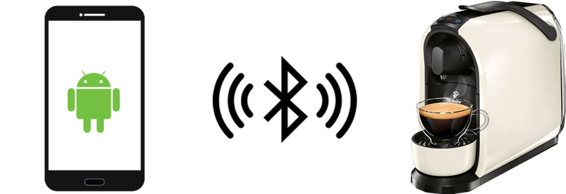
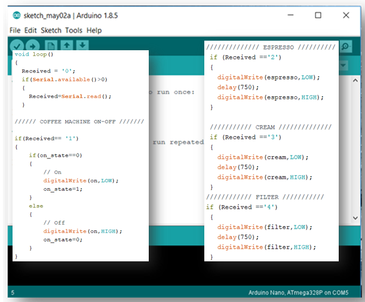
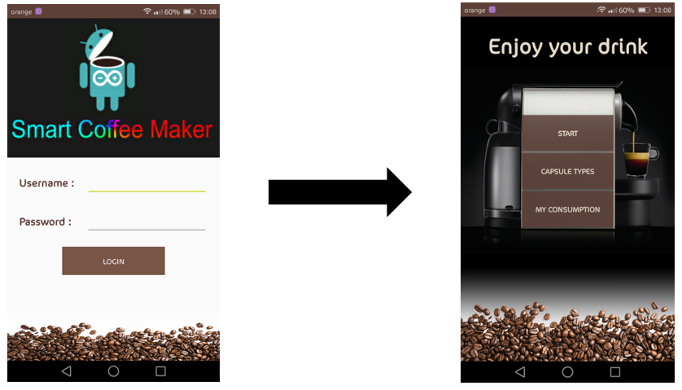
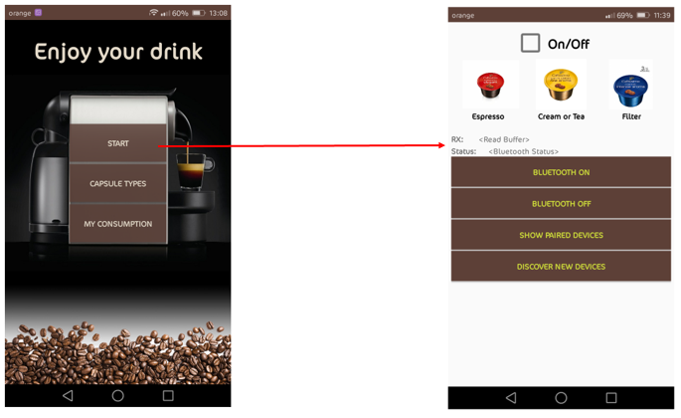
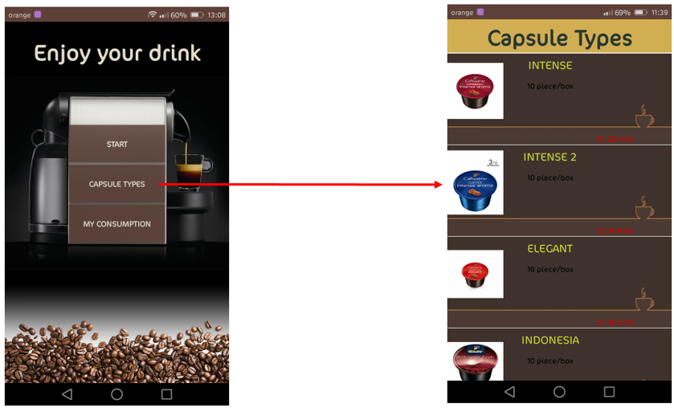
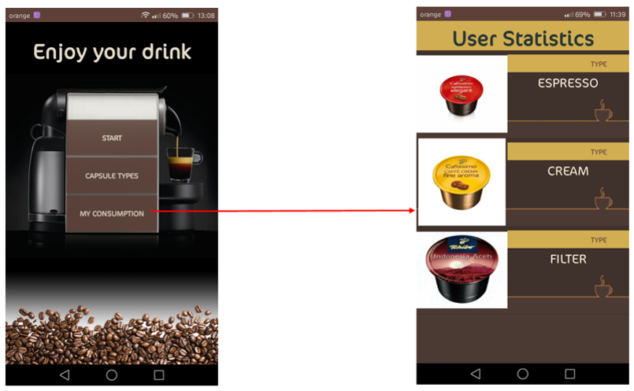
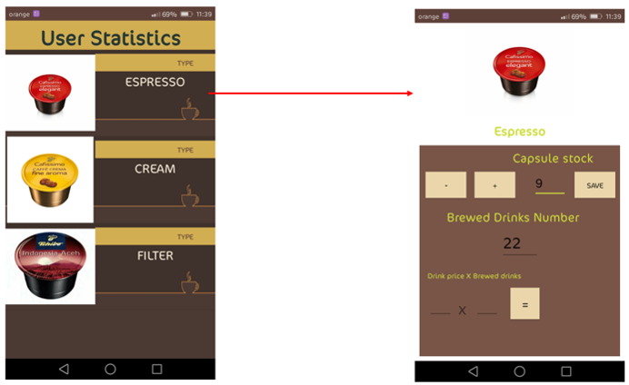

# smartcoffeemaker
Smart Coffee Maker is an Android App for brewing coffee with a smartphone. 

- Unique Logo Design

- Smartphone and Coffee Maker communication

- Arduino code detail

- Some image about the application

- Login

*Connecting to the coffee maker via Bluetooth HC-05  
*After connection, caffee maker can be turn on. 
*We should waiting 2 minutes to heating up the coffee maker  
*After we can choose three types of coffee: Espresso, Cream and Filter 

- List of coffee capsule types what can you buy in the shop for this coffee maker 

- User statistics 
*If you buy 10 capsule of Espresso you can add here,  
*and after you brewed a coffee the number decreasing 
*If the number is 3 or less, you can see a popup where warns you to buy coffee, 
because you running out.

